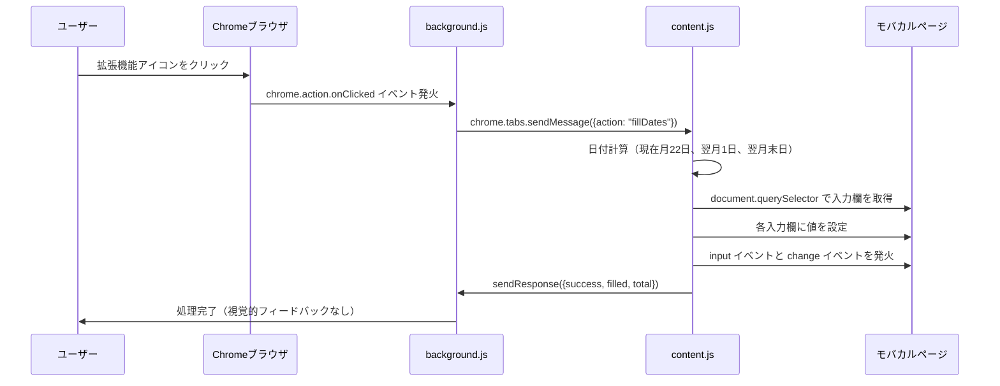

# モバカル訪問看護指示書 日付自動入力ツール - 開発者向け仕様書

## プロジェクト概要

このプロジェクトは、Google Chrome拡張機能（Manifest V3）として実装された、モバカル電子カルテシステムの訪問看護指示書作成ページ向けの日付自動入力ツールです。

## 技術仕様

### 使用技術

- **Manifest V3**: Chrome拡張機能の最新仕様
- **JavaScript (ES6+)**: 実装言語
- **Chrome Extensions API**: 拡張機能の機能実装

### 対応ブラウザ

- Google Chrome（最新版推奨）
- Microsoft Edge（Chromium版）

## プロジェクト構成

```
mobakal_houkan_sijisyo/
├── manifest.json          # 拡張機能のマニフェストファイル
├── background.js          # バックグラウンドスクリプト（サービスワーカー）
├── content.js             # コンテンツスクリプト（ページに注入されるスクリプト）
├── 導入手順.md            # ユーザー向け導入手順
├── 開発者向け仕様書.md     # 本ファイル
└── README.md              # プロジェクト概要
```

## ファイル詳細

### manifest.json

拡張機能の基本設定を定義するファイルです。

**主要な設定項目：**

- `manifest_version: 3`: Manifest V3を使用
- `permissions: ["activeTab"]`: 現在アクティブなタブへのアクセス権限
- `background.service_worker`: バックグラウンドスクリプトの指定
- `action.onClicked`: アイコンクリック時の動作（ポップアップなし）
- `content_scripts`: すべてのURLにマッチするコンテンツスクリプト

**権限について：**

- `activeTab`: ユーザーが拡張機能のアイコンをクリックしたときに、現在アクティブなタブにアクセスする権限。最小限の権限でセキュリティを確保。

### background.js

拡張機能のアイコンクリックを検知し、コンテンツスクリプトにメッセージを送信するサービスワーカーです。

**処理フロー：**

1. `chrome.action.onClicked` イベントリスナーを設定
2. アイコンクリック時に現在のアクティブタブを取得
3. `chrome.tabs.sendMessage` でコンテンツスクリプトに `{ action: "fillDates" }` メッセージを送信
4. エラーハンドリングを実装

**技術的な注意点：**

- Manifest V3では、バックグラウンドページの代わりにサービスワーカーを使用
- サービスワーカーは非アクティブ時に停止する可能性があるため、イベントリスナーは常に登録される

### content.js

実際の日付計算と入力欄への値設定を行うスクリプトです。ページのDOMに直接アクセスします。

**主要な関数：**

#### `formatDate(date)`
- 日付オブジェクトを `YYYY-MM-DD` 形式の文字列に変換
- 月と日は2桁でゼロパディング

#### `getCurrentMonth22nd()`
- 現在の日付から、実行した月の22日を取得
- 例: 2025年12月24日 → 2025年12月22日

#### `getNextMonthFirst()`
- 翌月の1日を取得
- 例: 2025年12月24日 → 2026年1月1日

#### `getNextMonthLast()`
- 翌月の末日を取得（28/29/30/31日のいずれか）
- JavaScriptの `Date` オブジェクトの特性を利用（月+2、日=0で前月の末日を取得）
- 例: 2025年12月24日 → 2026年1月31日

#### `setInputValue(inputElement, value, fieldName)`
- 入力要素に値を設定
- `input` イベントと `change` イベントを発火（システムが変更を認識するため）
- エラーハンドリングとログ出力を実装

**メッセージハンドラー：**

- `chrome.runtime.onMessage.addListener` でメッセージを受信
- `request.action === "fillDates"` の場合に処理を実行
- 4つの入力欄を `document.querySelector('input[name="..."]')` で取得
- 各入力欄に値を設定し、成功数をカウント
- レスポンスを返す（非同期処理のため `return true` を返す）

## 日付計算ロジック

### 入力対象と計算ルール

| 入力欄名 | name属性 | 計算ロジック | 例（2025年12月24日実行時） |
|---------|---------|-------------|---------------------------|
| 診療日（検索用） | `disp_date` | 実行した月の22日 | `2025-12-22` |
| 記入日 | `char1_kinyubi` | 実行した月の22日 | `2025-12-22` |
| 訪看指示期間（開始） | `char1_houkanstart` | 翌月の1日 | `2026-01-01` |
| 訪看指示期間（終了） | `char1_houkanend` | 翌月の末日 | `2026-01-31` |

### 日付フォーマット

すべての日付は **YYYY-MM-DD** 形式で統一されています。

例：
- `2025-12-22`
- `2026-01-01`
- `2026-01-31`

## 動作フロー



## 要素の特定方法

### 重要な設計判断

**動的IDを避ける理由：**

HTMLの例：
```html
<input id="dp1766536579980" name="char1_kinyubi" ...>
```

- `id` 属性は動的に生成される（`dp...` 形式）
- ページをリロードするたびにIDが変わる可能性がある
- そのため、`name` 属性を使用して要素を特定

**要素の取得方法：**

```javascript
document.querySelector('input[name="disp_date"]')
document.querySelector('input[name="char1_kinyubi"]')
document.querySelector('input[name="char1_houkanstart"]')
document.querySelector('input[name="char1_houkanend"]')
```

## イベント発火の重要性

### なぜイベントを発火する必要があるか

単に `inputElement.value = value` を設定するだけでは、多くのWebアプリケーションが変更を検知できません。特にjQueryやReactなどのフレームワークを使用している場合、直接的な値の変更は検知されないことがあります。

**実装：**

```javascript
// inputイベントを発火
const inputEvent = new Event('input', {
  bubbles: true,
  cancelable: true
});
inputElement.dispatchEvent(inputEvent);

// changeイベントを発火
const changeEvent = new Event('change', {
  bubbles: true,
  cancelable: true
});
inputElement.dispatchEvent(changeEvent);
```

これにより、システムが変更を正しく認識し、バリデーションや保存処理が正常に動作します。

## エラーハンドリング

### 実装されているエラーハンドリング

1. **入力欄が見つからない場合**
   - コンソールにエラーメッセージを出力
   - 処理は継続し、他の入力欄は正常に処理される

2. **メッセージ送信エラー**
   - `background.js` で `chrome.runtime.lastError` をチェック
   - コンソールにエラーメッセージを出力

3. **成功/失敗の追跡**
   - 各入力欄の設定結果をカウント
   - レスポンスで成功数を返す

## 開発環境のセットアップ

### 必要な環境

- Google Chrome（最新版）
- テキストエディタ（VS Code推奨）

### 開発手順

1. プロジェクトフォルダをクローンまたはダウンロード
2. Chromeで `chrome://extensions/` を開く
3. 「デベロッパーモード」をONにする
4. 「パッケージ化されていない拡張機能を読み込む」でプロジェクトフォルダを選択
5. コードを編集したら、拡張機能の「再読み込み」ボタンをクリック

### デバッグ方法

1. **バックグラウンドスクリプトのデバッグ**
   - `chrome://extensions/` で拡張機能の「サービスワーカー」リンクをクリック
   - 開発者ツールが開き、`background.js` のデバッグが可能

2. **コンテンツスクリプトのデバッグ**
   - モバカルのページを開く
   - F12キーで開発者ツールを開く
   - 「Console」タブで `content.js` のログとエラーを確認

3. **ログの確認**
   - `content.js` では各入力欄の設定時にコンソールログを出力
   - エラー時もコンソールにメッセージを出力

## 再現性のある開発のための情報

### 依存関係

このプロジェクトには外部ライブラリやパッケージマネージャーは使用していません。純粋なJavaScriptとChrome Extensions APIのみで実装されています。

### ビルドプロセス

ビルドプロセスは不要です。ファイルをそのままChromeに読み込むことができます。

### バージョン管理

- `manifest.json` の `version` フィールドでバージョンを管理
- 現在のバージョン: `1.0.0`

### テスト方法

1. モバカルの訪問看護指示書作成ページを開く
2. 拡張機能のアイコンをクリック
3. 4つの入力欄に正しい日付が入力されることを確認
4. 開発者ツールのコンソールでエラーがないことを確認

### 将来の拡張可能性

- 設定画面の追加（日付の計算ルールをカスタマイズ可能にする）
- 複数の日付パターンの保存と選択
- 他の入力欄への対応
- エクスポート/インポート機能

## セキュリティ考慮事項

### 権限の最小化

- `activeTab` 権限のみを使用
- ユーザーが明示的にアイコンをクリックした場合のみ動作
- すべてのURLにマッチするが、メッセージが送信されない限り動作しない

### データの取り扱い

- この拡張機能は外部サーバーにデータを送信しません
- すべての処理はローカルで完結します
- ユーザーデータを保存しません

## ライセンス

（プロジェクトのライセンス情報を記載してください）

## 更新履歴

### Version 1.0.0 (2025-12-24)

- 初回リリース
- 4つの日付入力欄への自動入力機能を実装
- Manifest V3対応

